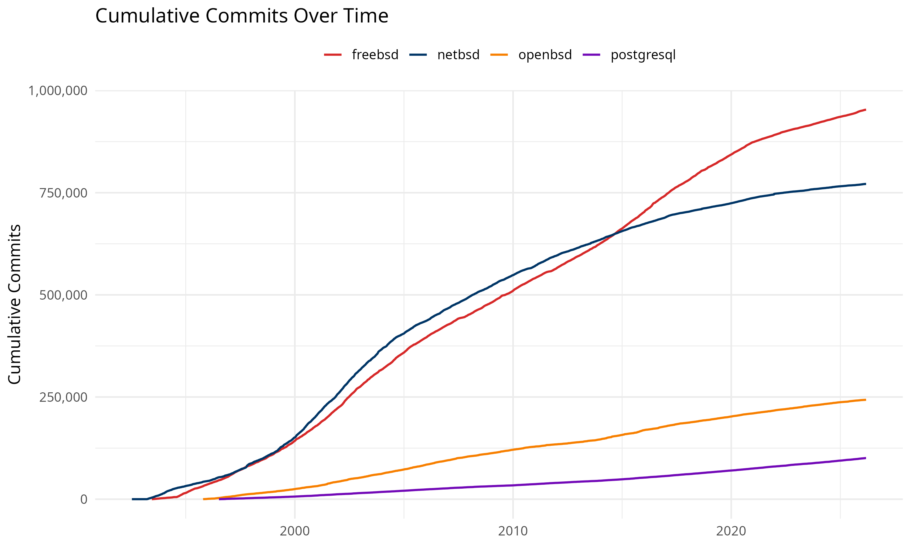
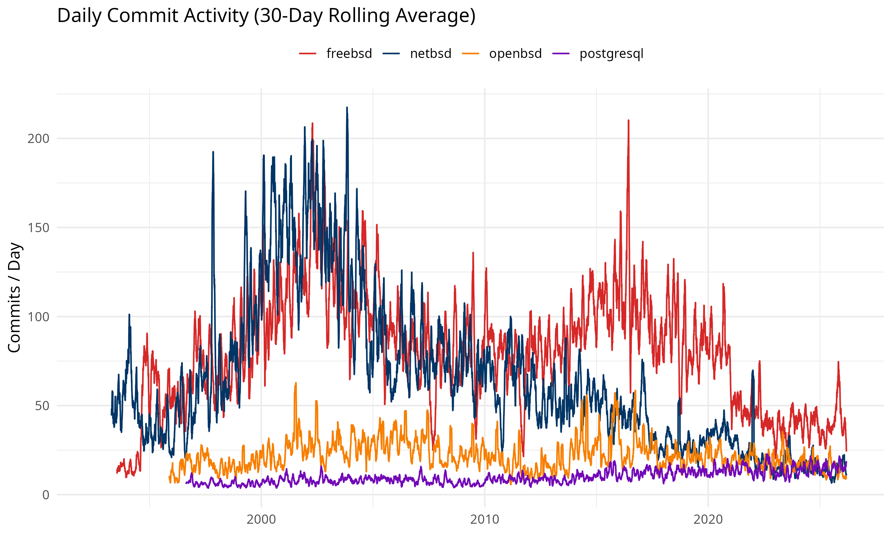
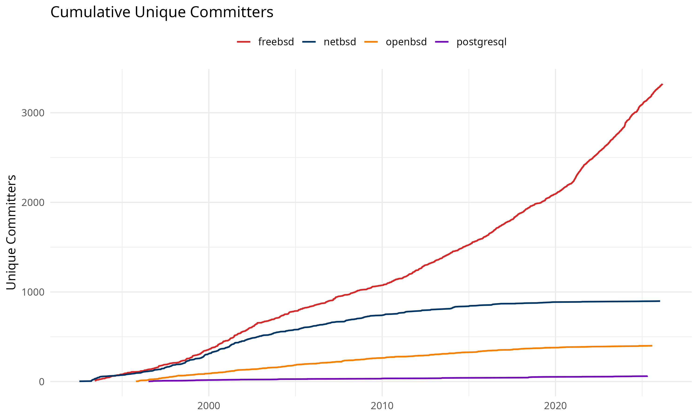
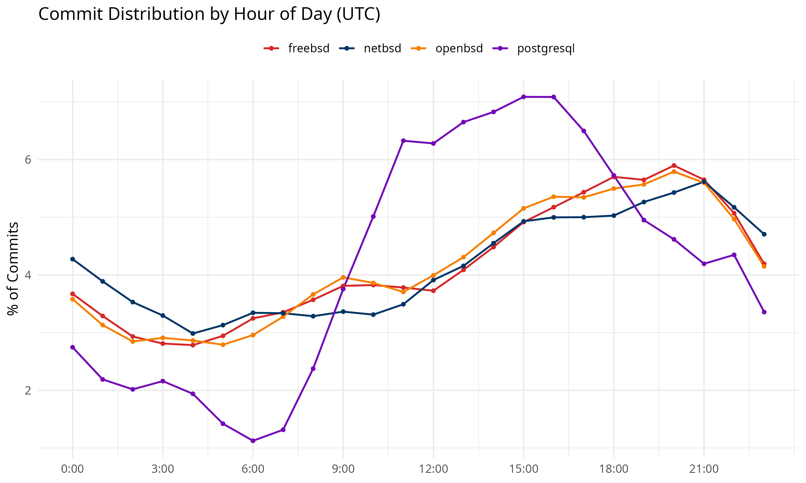
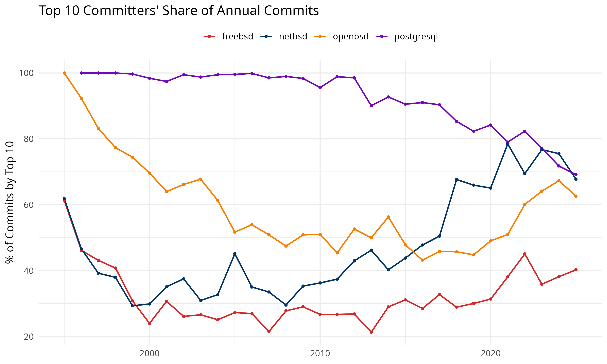
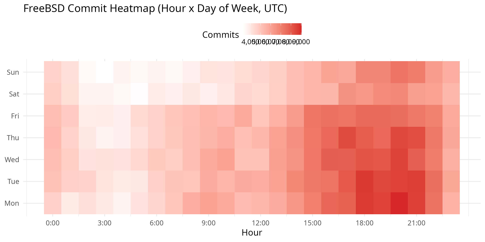
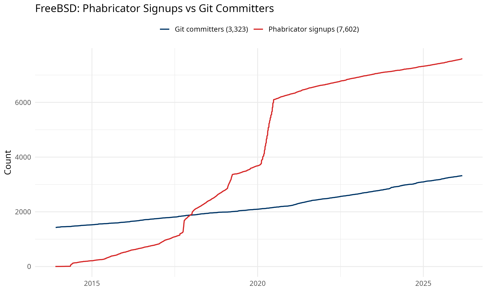
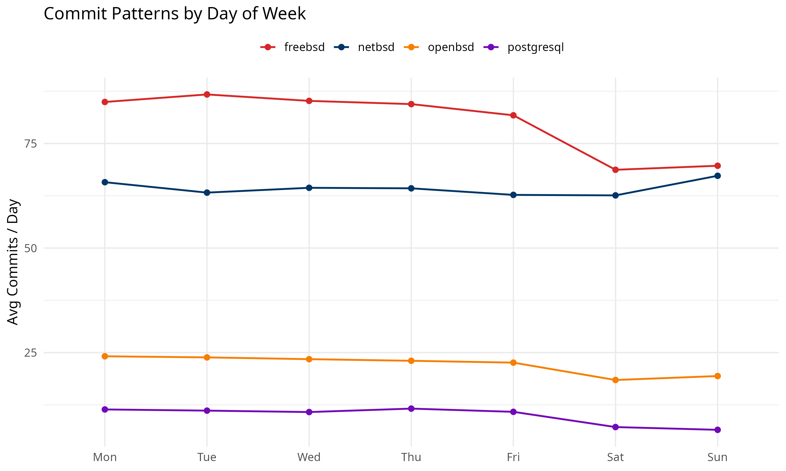

# osscontribs

Over 30 years of open source project activity, packaged for R.

This dataset covers **FreeBSD**, **OpenBSD**, **NetBSD**, and **PostgreSQL** —
four foundational projects that have shaped modern computing. The data comes
from two sources:

- **Git repositories** (cloned and parsed locally) — every commit, every author, no API limits
- **FreeBSD Phabricator** — account signups on the code review platform

No personal information is included. Authors are counted, not identified.

## Why this exists

Most open source research relies on GitHub API data, which caps results at the
top 100 contributors per repo. These datasets bypass that limitation entirely
by extracting commit logs directly from cloned repositories. The result is a
complete picture of project activity going back to the early 1990s.

Good for: time series analysis, growth modeling, changepoint detection,
cross-project comparison, or just satisfying curiosity about how these
projects evolved over three decades.

## Installation

```r
devtools::install_github("chrislongros/osscontribs")
```

## Datasets at a glance

| Dataset | Rows | Granularity | Source | What it measures |
|---------|------|-------------|--------|------------------|
| `oss_commits` | 2,068,717 | Per-commit | Git repos | Every commit with timestamp and author |
| `oss_daily_commits` | 44,939 | Daily | Git repos | Commits per day |
| `oss_daily_authors` | 2,932 | Daily | Git repos | First-time committers per day |
| `oss_weekly_commits` | 6,307 | Weekly | GitHub API | Commits per week (top 100 authors) |
| `oss_contributors` | 447 | Monthly | Mixed | New signups per month |
| `oss_contributors_daily` | 2,531 | Daily | Phabricator | FreeBSD signups per day |

### From git repositories (complete data)

#### `oss_commits`

Every individual commit with full timestamp (to the second) and anonymized
author ID. The most granular dataset — 2M+ rows across all four projects.

| Column | Type | Description |
|--------|------|-------------|
| `project` | character | freebsd, openbsd, netbsd, or postgresql |
| `timestamp` | POSIXct | Commit timestamp in UTC |
| `author_id` | character | Anonymized 12-character author hash |

#### `oss_daily_commits`

Daily commit counts extracted from cloned repos. This is the most complete
commit dataset — it includes every commit, not just top contributors.

| Column | Type | Description |
|--------|------|-------------|
| `project` | character | freebsd, openbsd, netbsd, or postgresql |
| `date` | Date | Commit date |
| `commits` | integer | Commits that day |
| `cumulative_commits` | integer | Running total |

#### `oss_daily_authors`

Tracks when each unique author made their first commit to a project.
Useful for measuring how quickly a project attracts new contributors.

| Column | Type | Description |
|--------|------|-------------|
| `project` | character | Project name |
| `date` | Date | Date of first commit |
| `new_authors` | integer | New committers that day |
| `cumulative_authors` | integer | Running total of unique committers |

### From GitHub API and Phabricator

#### `oss_weekly_commits`

Weekly commit data from GitHub's stats API. Limited to the top 100
contributors per project — superseded by `oss_daily_commits` for most uses,
but kept for backward compatibility.

#### `oss_contributors` / `oss_contributors_daily`

Signup data — account registrations, not commit activity. Many users sign up
but never commit, so these numbers are higher than committer counts.

## Quick start

```r
library(osscontribs)

# Cumulative commits over time
data(oss_daily_commits)
projects <- split(oss_daily_commits, oss_daily_commits$project)
plot(NULL, xlim = range(oss_daily_commits$date),
     ylim = c(0, max(oss_daily_commits$cumulative_commits)),
     xlab = "Date", ylab = "Total Commits",
     main = "30 Years of Open Source Commits")
cols <- c(freebsd = "red", openbsd = "orange",
          netbsd = "blue", postgresql = "purple")
for (p in names(projects)) {
  lines(projects[[p]]$date, projects[[p]]$cumulative_commits,
        col = cols[p], lwd = 2)
}
legend("topleft", names(cols), col = cols, lwd = 2)
```

## Plots

















## Project totals

| Project | Total Commits | Unique Authors | Date Range |
|---------|--------------|----------------|------------|
| FreeBSD | 953,162 | 3,323 | 1993–2026 |
| NetBSD | 771,519 | 898 | 1992–2026 |
| OpenBSD | 243,309 | 400 | 1995–2026 |
| PostgreSQL | 100,727 | 61 | 1996–2026 |

## Sources

- Git data: Cloned from
  [freebsd/freebsd-src](https://github.com/freebsd/freebsd-src),
  [openbsd/src](https://github.com/openbsd/src),
  [NetBSD/src](https://github.com/NetBSD/src),
  [postgres/postgres](https://github.com/postgres/postgres)
- Signup data: [reviews.freebsd.org](https://reviews.freebsd.org)

## License

CC0 — use it however you like.
